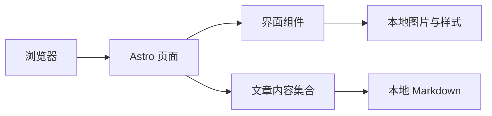
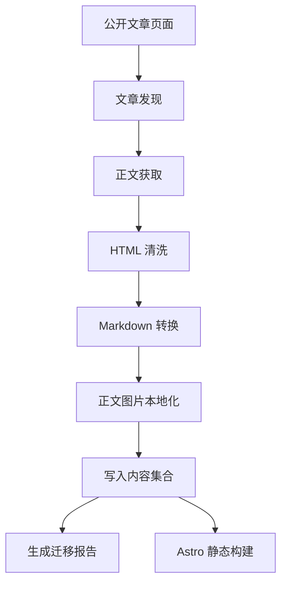

# 设计说明

## 模块职责

### 页面层

- `src/pages/`：定义首页、文章目录、文章详情和关于页。
- `src/layouts/`：提供全站 HTML 骨架和文章阅读布局。
- `src/components/`：提供导航、山水主视觉、文章列表、元数据和目录组件。

### 内容层

- `src/content.config.ts`：约束文章元数据。
- `src/content/articles/`：保存本地 Markdown 正文。
- `src/lib/articles.ts`：提供文章筛选、排序、分类和目录转换。

### 导入层

- `scripts/import-csdn/discover.ts`：发现公开文章索引。
- `scripts/import-csdn/fetch-article.ts`：获取单篇公开页面。
- `scripts/import-csdn/sanitize-html.ts`：清除页面外壳并转换为 Markdown。
- `scripts/import-csdn/download-assets.ts`：将正文图片转换并保存为本地 WebP。
- `scripts/import-csdn/write-content.ts`：生成带 frontmatter 的文章文件。
- `scripts/import-csdn/report.ts`：记录导入结果和失败原因。

## 组件关系

浏览器只读取构建后的静态文件。搜索、分类和排序均在浏览器本地完成，不需要后端服务。

## 数据流

导入内容始终按不可信输入处理。脚本和交互节点不会执行，正文生成后由内容测试和构建流程再次校验。

## 路由

- `/`：姓名、职业、技术方向和精选文章。
- `/articles`：支持搜索、分类和排序的文章目录。
- `/articles/<slug>/`：文章正文、元数据和目录。
- `/about`：站点说明。

## 视觉系统

- 宣纸白作为页面背景。
- 墨黑用于正文和主要操作。
- 雾灰用于辅助信息。
- 低饱和青绿色用于链接、分类和焦点状态。
- 朱红用于小面积识别元素。
- 首页使用本地 WebP 水墨山水图，不依赖外部图片服务。

## 可访问性

- 页面包含跳转到主要内容的链接和语义化区域。
- 键盘焦点有明确轮廓。
- 移动端目录使用原生 `details`。
- `prefers-reduced-motion` 会关闭装饰动画和平滑滚动。
